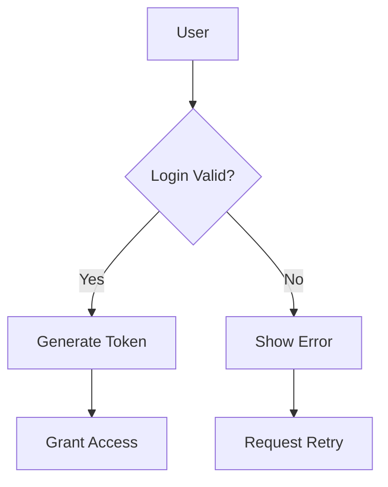
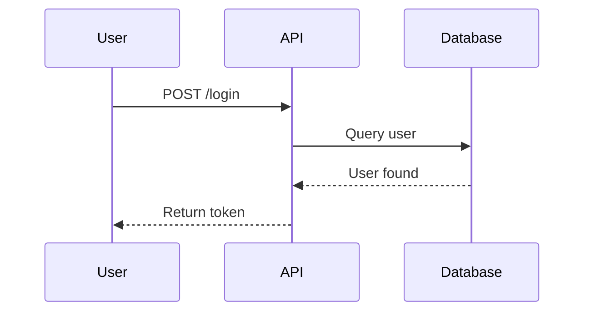
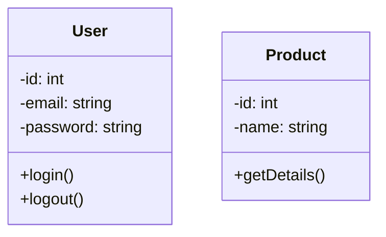
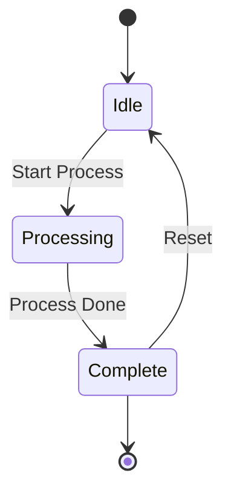

# 📄 Documentation Feature - Complete Implementation Guide

## Overview

A comprehensive documentation system has been added to GrowDev that allows users to create and manage two types of professional documents:

1. **📋 SRS (Software Requirements Specification)** - Define project requirements with functional specifications and UX considerations
2. **🏗️ SDD (Software Design Description)** - Design system architecture with visual Mermaid diagrams and components

## Features

### 🎯 SRS Document Features

- **📝 Basic Information Section**
  - Document title, description, project overview
  - Scope, constraints, and assumptions
  
- **✅ Functional Requirements Management**
  - Add unlimited requirements with easy add/remove UI
  - Each requirement includes:
    - Unique Requirement ID (REQ-001, REQ-002, etc.)
    - Title and detailed description
    - Priority levels (Low, Medium, High, Critical)
    - **🎨 UX Considerations** - Easy to add/remove UX items for each requirement
  
- **📥 PDF Export**
  - Professional PDF generation with color-coded priorities
  - Includes all sections with formatted layout
  - Export button on every SRS document

### 🏗️ SDD Document Features

- **📝 Basic Information**
  - Document title, description
  - Design overview and architecture overview
  
- **🔧 Components Management**
  - Add unlimited components
  - Each component includes:
    - Component name
    - Description and responsibility
    - Interfaces exposed
    - Diagram type selection (Mermaid or Custom)
  
- **📊 Advanced Diagram Support**
  
  **Option 1: AI-Powered Text to Diagram Conversion** ✨
  - Convert plain text descriptions to Mermaid diagrams automatically
  - Supported diagram types:
    - **Flowchart** - Process flows and decision trees
    - **Sequence Diagram** - Interaction sequences between components
    - **Class Diagram** - Class structures and relationships
    - **State Diagram** - State transitions and flows
  
  **Option 2: Manual Mermaid Diagram Creation** 📐
  - Write Mermaid syntax directly
  - Live preview before saving
  - Full support for all Mermaid diagram types
  
  **Option 3: Drag-and-Drop Diagram Creator** (Future Enhancement)
  - Visual diagram builder interface
  
- **📥 PDF Export**
  - Professional PDF with all components and diagrams
  - Mermaid diagrams rendered in PDF
  - Component descriptions with formatting

## 🚀 Usage Guide

### Creating an SRS Document

1. **Navigate to Documentation**
   - Log in to your account
   - On the homepage, hover over the green "📄 Create Documentation" button
   - Select "📋 Create SRS Document"

2. **Fill Basic Information**
   - Enter document title
   - Add description, project overview, scope
   - Specify constraints and assumptions

3. **Add Functional Requirements**
   - Click "+ Add Requirement" button
   - Fill in requirement details:
     - Requirement ID (e.g., REQ-001)
     - Title of the requirement
     - Detailed description
     - Priority level
   - **Add UX Considerations**
     - Click "+ Add UX Item" in each requirement
     - Add items like "Responsive design", "Dark mode support", etc.
     - Remove items with the "✕" button

4. **Save and Export**
   - Click "💾 Save SRS" to save your document
   - Click "📥 Export PDF" to download as PDF

### Creating an SDD Document

1. **Navigate to Documentation**
   - Log in to your account
   - On the homepage, click "🏗️ Create SDD Document"

2. **Fill Basic Information**
   - Enter document title and description
   - Add design overview and architecture overview

3. **Add Components**
   - Click "+ Add Component" button
   - Fill in component details:
     - Component name (e.g., "User Service")
     - Description of what it does
     - Responsibility (what it's responsible for)
     - Interfaces it exposes
     - Diagram type (Mermaid or Custom)

4. **Create Diagrams**

   **Option A: Convert Text to Diagram**
   - Click "✨ AI Convert Text" tab
   - Enter text description of your system flow
   - Select diagram type (Flowchart, Sequence, Class, State)
   - Click "🔄 Generate Mermaid Diagram"
   - Preview the generated diagram
   - Click "✅ Save this Diagram" to add to document

   **Example Text:**
   ```
   The user logs in with credentials, system validates against database,
   if valid returns a JWT token, if invalid shows error message.
   User then uses token for authenticated requests.
   ```

   **Option B: Manual Mermaid Diagram**
   - Click "📐 Create Manual Diagram" tab
   - Enter diagram name
   - Write Mermaid syntax (examples below)
   - Click "👁️ Preview Diagram"
   - Click "✅ Save this Diagram"

5. **Save and Export**
   - Click "💾 Save SDD" to save document
   - Click "📥 Export PDF" to download as PDF

## 📚 Mermaid Diagram Examples

### Flowchart Example


### Sequence Diagram Example


### Class Diagram Example


### State Diagram Example


## 📂 Database Structure

### SRS Tables
- `srs_documents` - Main SRS document with user association
- `srs_functional_requirements` - Individual functional requirements with UX considerations (stored as JSON)

### SDD Tables
- `sdd_documents` - Main SDD document with user association
- `sdd_components` - Components with diagram data
- `sdd_diagrams` - Saved diagrams (Mermaid or custom)

## 🔐 Security & Authorization

- All documents are owned by specific users
- Users can only view/edit/delete their own documents
- Authorization policies implemented for all actions
- CSRF protection on all forms

## 📥 PDF Export Features

- **SRS PDF Includes:**
  - Document header with creation date
  - Project overview, scope, constraints
  - All functional requirements with priorities
  - UX considerations for each requirement
  - Professional color-coded priority badges

- **SDD PDF Includes:**
  - Document header with architecture info
  - Design and architecture overview
  - All components with descriptions
  - Rendered Mermaid diagrams
  - Component interfaces and responsibilities

## 🛣️ API Endpoints

```
# SRS Routes
GET    /documentation/srs                     - List all SRS documents
GET    /documentation/srs/create              - Create form
POST   /documentation/srs                     - Store new SRS
GET    /documentation/srs/{id}/edit           - Edit form
PUT    /documentation/srs/{id}                - Update SRS
GET    /documentation/srs/{id}/pdf            - Export PDF
DELETE /documentation/srs/{id}                - Delete SRS

# SDD Routes
GET    /documentation/sdd                     - List all SDD documents
GET    /documentation/sdd/create              - Create form
POST   /documentation/sdd                     - Store new SDD
GET    /documentation/sdd/{id}/edit           - Edit form
PUT    /documentation/sdd/{id}                - Update SDD
GET    /documentation/sdd/{id}/pdf            - Export PDF
DELETE /documentation/sdd/{id}                - Delete SDD

# API
POST   /api/documentation/text-to-diagram    - Convert text to Mermaid
```

## 🎨 UI/UX Design

- **Responsive Design** - Works on desktop, tablet, and mobile
- **Color-Coded** - SRS uses indigo, SDD uses green for visual distinction
- **Inline Editing** - Add/remove items without page reload
- **Live Preview** - See diagrams before saving
- **Dropdown Navigation** - Easy access from homepage
- **Professional Templates** - Clean, modern design with Tailwind CSS

## 🚀 Future Enhancements

1. **Drag-and-Drop Diagram Creator** - Visual diagram builder without Mermaid syntax
2. **Diagram Templates** - Pre-built diagram templates for common scenarios
3. **Collaboration** - Share and collaborate on documents with team members
4. **Version History** - Track changes and rollback to previous versions
5. **Export Formats** - DOCX, HTML, Markdown exports in addition to PDF
6. **Diagram Export** - Export diagrams as PNG/SVG images
7. **Custom Themes** - Support for custom PDF themes and branding
8. **AI-Enhanced Descriptions** - Auto-generate descriptions from code analysis
9. **Integration with Requirements Tools** - Import/export from Jira, Azure DevOps
10. **Mobile App** - Native mobile app for document editing

## 📞 Support

For issues or questions:
1. Check the documentation pages
2. Review the Mermaid syntax guide at https://mermaid.js.org
3. Ensure all required fields are filled before saving
4. Check browser console for JavaScript errors

## 📝 Notes

- All changes are auto-saved when you click "Save" button
- Diagrams are stored as text (Mermaid syntax), allowing easy updates
- PDF exports are generated on-demand and include current state of document
- UX considerations are stored as JSON arrays in the database
- Multiple diagrams can be added to a single SDD document

---

**Last Updated**: October 21, 2025
**Feature Status**: ✅ Production Ready
