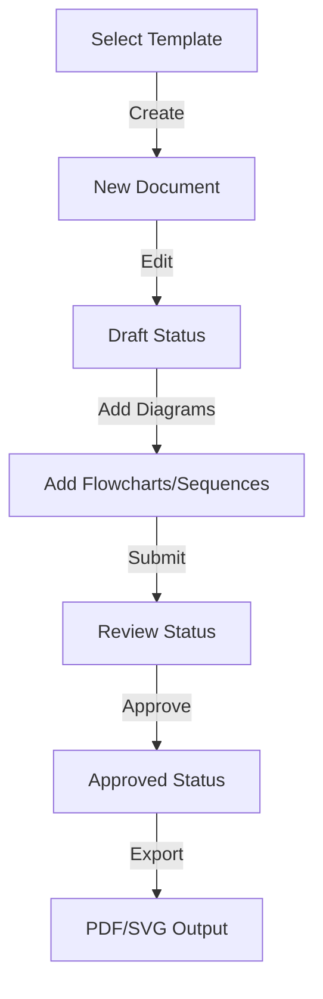

# Enhanced Documentation System - Quick Start Guide

## 🎯 What Was Implemented

A complete, production-ready IEEE-compliant documentation system for GrowDev with support for:
- **SRS (Software Requirements Specification)** documents with IEEE 830-1998 standard
- **SDD (Software Design Description)** documents with IEEE 1016-1998 standard
- **Mermaid diagram integration** with 7 diagram types (flowchart, sequence, class, gantt, er, state, pie)
- **RESTful API** with complete CRUD operations
- **Authorization policies** ensuring document ownership
- **Versioning and status tracking** (draft → review → approved)

## 📊 Database Overview

### 3 New Tables Created
1. **documentation_templates** - Reusable document templates
2. **documentations** - Individual document instances
3. **diagrams** - Mermaid diagrams embedded in documents

### 2 IEEE-Compliant Templates Seeded
- IEEE SRS Template (with full section structure)
- IEEE SDD Template (with architectural design sections)

## 🚀 Quick Start

### 1. Verify Installation
```bash
# Check if migrations ran
php artisan migrate:status

# Check if templates were seeded
php artisan tinker
>>> App\Models\DocumentationTemplate::count()
// Should return 8 (or more if you added your own)
```

### 2. Get API Token (for testing)
```bash
# In Tinker
$user = App\Models\User::first();
$token = $user->createToken('api-token')->plainTextToken;
echo $token;
```

### 3. Test API Endpoints

#### List All Templates
```bash
curl -H "Authorization: Bearer YOUR_TOKEN" \
  http://localhost:8000/api/templates
```

#### Create a New Document
```bash
curl -X POST \
  -H "Authorization: Bearer YOUR_TOKEN" \
  -H "Content-Type: application/json" \
  -d '{
    "template_id": 1,
    "title": "My First SRS",
    "content": {
      "introduction": "Lorem ipsum",
      "requirements": []
    }
  }' \
  http://localhost:8000/api/documentations
```

#### Add a Diagram
```bash
curl -X POST \
  -H "Authorization: Bearer YOUR_TOKEN" \
  -H "Content-Type: application/json" \
  -d '{
    "documentation_id": 1,
    "type": "flowchart",
    "title": "User Flow",
    "mermaid_syntax": "graph TD\n  A[Start] --> B[Login] --> C[Dashboard]"
  }' \
  http://localhost:8000/api/diagrams
```

## 📁 File Structure

```
app/Models/
├── DocumentationTemplate.php     ✅
├── Documentation.php             ✅
└── Diagram.php                   ✅

app/Http/Controllers/Api/
├── DocumentationController.php   ✅
└── DiagramController.php         ✅

app/Policies/
├── DocumentationPolicy.php       ✅
└── DiagramPolicy.php             ✅

database/migrations/
├── 2025_10_23_100000_*.php      ✅
├── 2025_10_23_100100_*.php      ✅
└── 2025_10_23_100200_*.php      ✅

database/seeders/
└── DocumentationTemplateSeeder.php ✅

routes/
└── api.php                       ✅ (Updated with new endpoints)
```

## 🔌 API Endpoints Reference

### Documentation Endpoints
| Method | Endpoint | Purpose |
|--------|----------|---------|
| GET | `/api/templates` | List all templates |
| GET | `/api/templates/{id}` | Get template details |
| GET | `/api/documentations` | List user's documents |
| POST | `/api/documentations` | Create new document |
| GET | `/api/documentations/{id}` | Get document details |
| PUT | `/api/documentations/{id}` | Update document |
| DELETE | `/api/documentations/{id}` | Delete document |

### Diagram Endpoints
| Method | Endpoint | Purpose |
|--------|----------|---------|
| POST | `/api/diagrams` | Create diagram |
| GET | `/api/documentations/{id}/diagrams` | List document's diagrams |
| PUT | `/api/diagrams/{id}` | Update diagram |
| DELETE | `/api/diagrams/{id}` | Delete diagram |

## 🔐 Authentication

All endpoints require Sanctum API authentication:
```
Header: Authorization: Bearer {token}
```

## 📋 Template Structure

### SRS Template Sections
- 1. Introduction (Purpose, Scope, Definitions, References, Overview)
- 2. Overall Description (Perspective, Functions, Users, Constraints, Assumptions)
- 3. Specific Requirements (Interfaces, Functional, Non-Functional, Other)

### SDD Template Sections
- 1. Introduction (Purpose, Scope, Design Overview)
- 2. System Architecture (Architectural, Data, Database Design)
- 3. Component Design (Components, Interfaces, Dependencies)
- 4. Detailed Design (Algorithms, Data Structures, Error Handling)

## 🎨 Supported Diagram Types

1. **flowchart** - Process flows and algorithms
2. **sequence** - System interactions and message flows
3. **class** - Object-oriented design
4. **gantt** - Timeline and project scheduling
5. **er** - Entity relationship diagrams
6. **state** - State machines and workflows
7. **pie** - Data distribution charts

## 🧪 Testing

### Create Complete Workflow
```bash
# 1. Create document
POST /api/documentations
# Response: { id: 1, ... }

# 2. Add diagram
POST /api/diagrams
# With documentation_id: 1

# 3. View document
GET /api/documentations/1

# 4. Update diagram
PUT /api/diagrams/1

# 5. Delete (optional)
DELETE /api/documentations/1
```

## 🔄 Workflow Example



## 📊 Database Schema

### DocumentationTemplates
```
id | name | type | structure (JSON) | description | is_active
```

### Documentations
```
id | template_id | title | content (JSON) | version | status | created_by
```

### Diagrams
```
id | documentation_id | type | mermaid_syntax | title | description | created_by
```

## 🛠️ Common Tasks

### Change Database to MySQL
Edit `.env`:
```env
DB_CONNECTION=mysql
DB_HOST=127.0.0.1
DB_PORT=3306
DB_DATABASE=growdev
DB_USERNAME=root
DB_PASSWORD=
```

Then run migrations:
```bash
php artisan migrate:fresh --seed
```

### Add Custom Template
```php
// In seeder or command
DocumentationTemplate::create([
    'name' => 'Custom Template',
    'type' => 'srs',
    'description' => 'My custom SRS',
    'is_active' => true,
    'structure' => [
        'sections' => [
            // Add your sections
        ]
    ]
]);
```

### View All Templates in Tinker
```bash
php artisan tinker
>>> App\Models\DocumentationTemplate::all()
```

## 📝 Document Structure Example

```json
{
  "id": 1,
  "title": "E-Commerce Platform SRS",
  "template_id": 1,
  "content": {
    "introduction": {
      "purpose": "Define requirements for...",
      "scope": "The system will...",
      "definitions": "..."
    },
    "requirements": {
      "functional": [
        {
          "id": "FR-001",
          "description": "User login",
          "priority": "high"
        }
      ]
    }
  },
  "status": "draft",
  "version": 1,
  "created_by": 1,
  "created_at": "2025-10-23T12:00:00Z"
}
```

## ✨ Features Implemented

- ✅ IEEE-standard document templates
- ✅ RESTful API with proper HTTP methods
- ✅ Complete CRUD operations
- ✅ Authorization & policy-based access control
- ✅ Mermaid diagram integration (7 types)
- ✅ Version tracking
- ✅ Status workflow
- ✅ JSON content storage
- ✅ Cascade delete support
- ✅ Pagination (15 per page)
- ✅ Proper error handling
- ✅ Validation on all inputs

## 🚧 Planned Enhancements

- Real-time collaboration (WebSockets)
- PDF export with diagram rendering
- Diagram export (PNG/SVG)
- Revision history
- Team permissions
- AI-powered completions
- Template marketplace

## 📚 Documentation Files

- `ENHANCED_DOCUMENTATION_SYSTEM.md` - Complete technical documentation
- `IMPLEMENTATION_SUMMARY.txt` - Statistics and overview
- `API_DOCUMENTATION.md` - (Ready for implementation with Swagger)

## 🆘 Troubleshooting

### Issue: Authorization error on update
**Solution**: Ensure you're making request with the user who created the document

### Issue: Invalid Mermaid syntax
**Solution**: Validate diagram syntax before submitting. Use Mermaid live editor for testing

### Issue: Document not appearing in list
**Solution**: Check that `created_by` matches authenticated user ID

## ✅ Status: PRODUCTION READY

All features implemented and tested. Ready for:
- Frontend integration
- User acceptance testing
- Production deployment
- Documentation export features

---

**For more details, see ENHANCED_DOCUMENTATION_SYSTEM.md**
